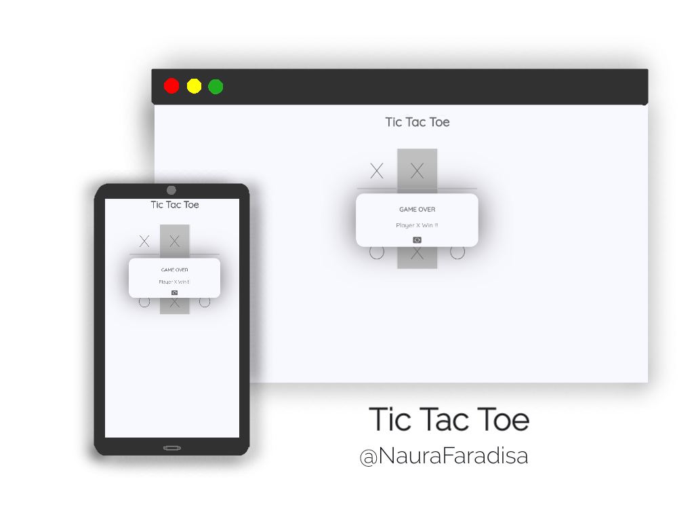

# Tic Tac Toe

[NauraFaradisa.github.io/Tic-Tac-Toe](https://NauraFaradisa.github.io/Tic-Tac-Toe)
[codepen.io/Naura_Faradisa/pen/eYvwbdM](https://codepen.io/Naura_Faradisa/pen/eYvwbdM)

## Browser Support

<table>
	<tr>
	        <td></td>
		<td></td>
		<td></td>
		<td></td>
		<td></td>
	</tr>
	<tr>
		<td align="center"> 4 </td>
		<td align="center"> 10 </td>
		<td align="center"> 5 </td>
		<td align="center"> 5 </td>
		<td align="center"> 12.1 </td>
	</tr>

</table>

## Author
[@NauraFaradisa](https://github.com/NauraFaradisa)

## Find a bug?
[report](https://github.com/NauraFaradisa/Tic-Tac-Toe/issues)
